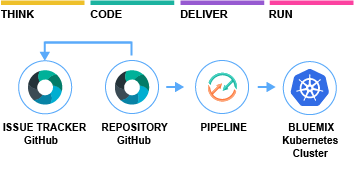

#  Metrics transformation toolchain

### Continuously deliver a Docker app to a Kubernetes Cluster to transform SL messages
This Metric transformation application uses Docker with docker and includes a DevOps toolchain that is preconfigured for continuous delivery, source control, issue tracking, and deployment to the IBM Bluemix Containers service.

### To get started, click this button:

---
### Learn more 

* Blog [Continuously deliver your app to Kubernetes with Bluemix](tbd)
* Step by step [tutorial](https://www.ibm.com/devops/method/tutorials/tc_secure_kube)
* **First-time IBM Container Service users**: Make sure that your container image registry is correctly set up with a [namespace](https://console.bluemix.net/docs/services/Registry/index.html).
* [Getting started with Bluemix clusters](https://console.bluemix.net/docs/containers/container_index.html?pos=2)
* [Getting started with toolchains](https://bluemix.net/devops/getting-started)
* [Documentation](https://console.ng.bluemix.net/docs/services/ContinuousDelivery/index.html?pos=2)
